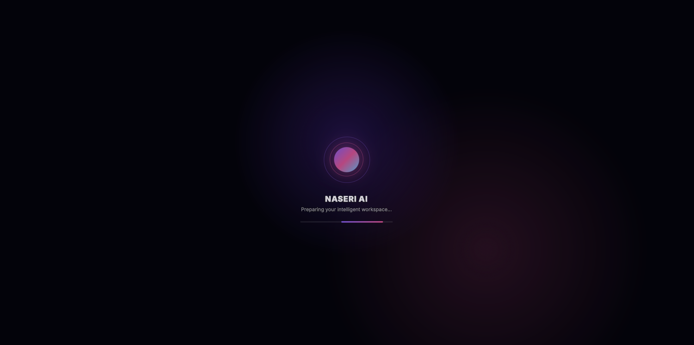
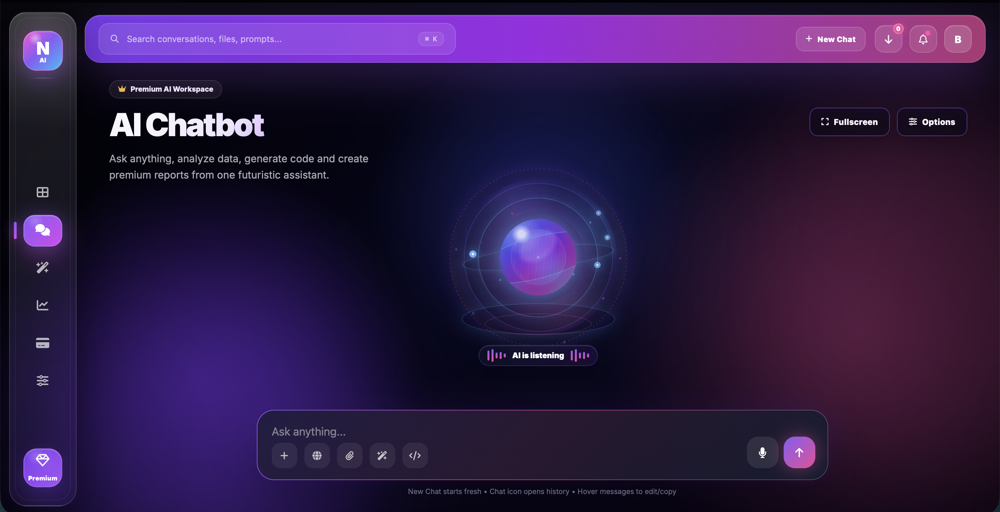
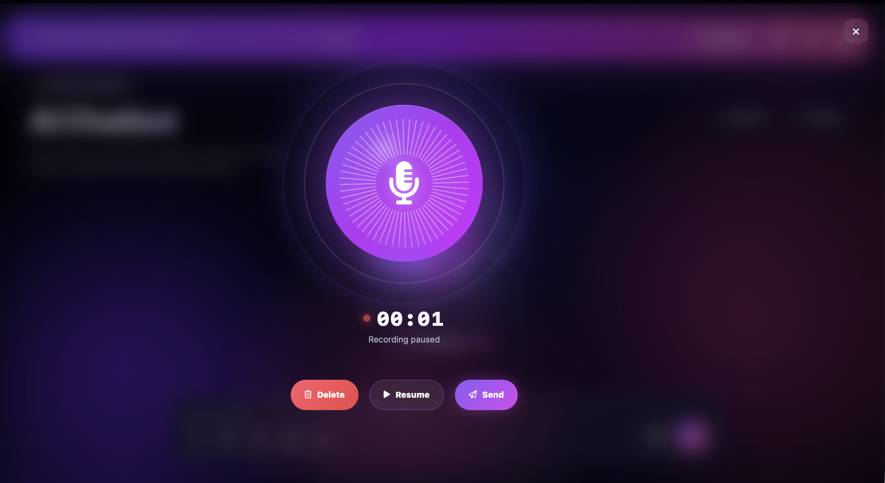
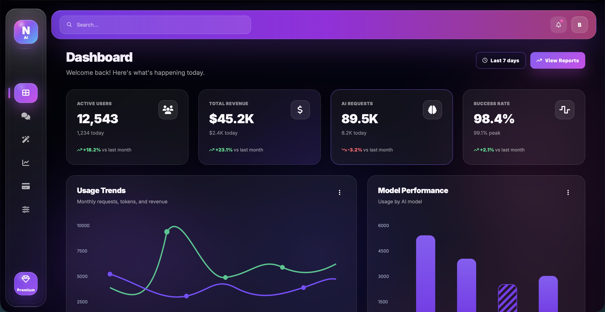
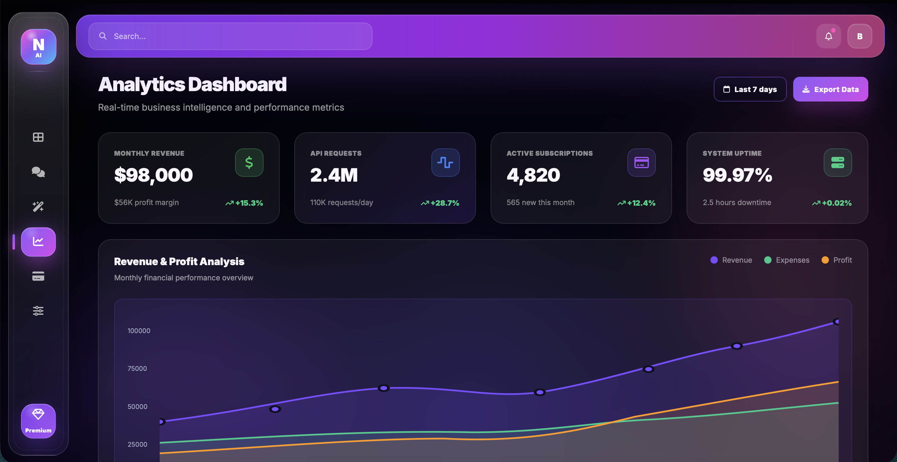
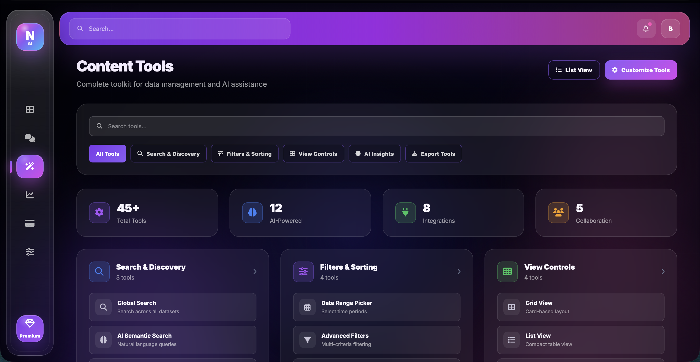
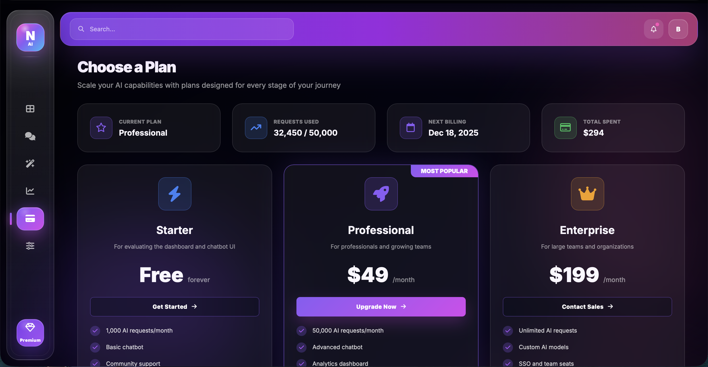
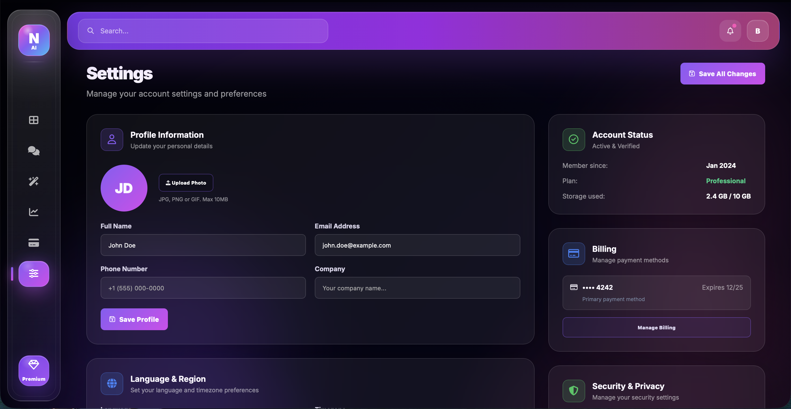

# NASERIAI

### Premium AI-Powered Workspace & Chat Platform

Modern AI Workspace built with cutting-edge UI/UX, intelligent chatbot interactions, analytics dashboards, content tools, subscription management and futuristic glassmorphism design.

---

## Overview

NASERIAI is a modern AI-powered workspace that combines conversational AI, business analytics, content creation tools, subscription management and advanced user settings into a single premium platform.

Designed with a futuristic glassmorphism interface, responsive layouts, animated interactions, and a professional SaaS dashboard experience.

---

##  Core Features

###  AI Chat Assistant

* Intelligent AI Chat Interface
* Voice Assistant Support
* Real-time Conversations
* Chat History Management
* New Chat Creation
* Fullscreen Chat Experience
* Export Chat
* Share Chat
* Download Generated Files
* Responsive Chat UI

### Analytics Dashboard

* Revenue Monitoring
* AI Usage Tracking
* User Statistics
* Subscription Insights
* Performance Metrics
* Interactive Charts
* Real-Time Reporting

###  Content Tools

* Content Creation Tools
* AI Writing Utilities
* Search & Discovery
* Export Tools
* Smart Filters
* View Controls
* AI Insights

###  Subscription Management

* Subscription Plans
* Billing Overview
* Upgrade Options
* Usage Tracking
* Payment Information

###  User Settings

* Profile Management
* Security Settings
* Notification Preferences
* Language Settings
* Privacy Controls
* Account Management

###  Voice Assistant

* AI Listening Mode
* Animated Voice Overlay
* Modern Recording Interface
* Audio Interaction Experience

---

#  Screenshots

## Loader Screen



---

## AI Chat Interface



---

### Recorder 


---

## Dashboard



---

## Analytics



---

## Content Tools



---

## Subscription Management



---

## Settings



---

#  Project Structure

```text
NASERIAI
│
├── index.html
├── dashboard.html
├── analytics.html
├── content-tools.html
├── subscription.html
├── settings.html
│
├── css/
│   ├── style.css
│   ├── dashboard.css
│   ├── analytics.css
│   ├── content-tools.css
│   ├── subscription.css
│   ├── settings.css
│   └── global-chat-history.css
│
├── js/
│   ├── script.js
│   ├── dashboard.js
│   ├── analytics.js
│   ├── content-tools.js
│   ├── subscription.js
│   ├── settings.js
│   ├── professional-sidebar.js
│   ├── global-chat-history.js
│   ├── safe-navigation.js
│   └── chat-navigation-guard.js
│
├── assets/
│   └── screenshots/
│       ├── Loader.png
│       ├── Chat.png
│       ├── dashboard.png
│       ├── analytic.png
│       ├── content.png
│       ├── subscription.png
│       └── setting.png
│
├── README.md
└── .gitignore
```

---

#  Getting Started

## Clone Repository

```bash
git clone https://github.com/baseetnaseri6/NASERIAI.git
```

## Open Project

```bash
cd NASERIAI
```

## Run Locally

Simply open:

```text
index.html
```

or start a local server:

```bash
python -m http.server 8000
```

Then visit:

```text
http://localhost:8000
```

---

#  Technologies Used

* HTML5
* CSS3
* JavaScript (Vanilla)
* Glassmorphism UI
* Responsive Design
* Local Storage
* CSS Animations
* Modern Dashboard Components
* Interactive Charts
* Voice Interaction UI

---

#  Responsive Design

Fully optimized for:

* Desktop
* Laptop
* Tablet
* Mobile Devices

---

#  Future Roadmap

* AI File Analysis
* AI Resume Analyzer
* AI Content Generator
* Multi-Model Support
* Team Collaboration
* Cloud Synchronization
* User Authentication
* Dark / Light Themes
* API Integrations
* AI Agent Workflows

---

#  Skills Demonstrated

* Frontend Development
* Responsive Web Design
* UI/UX Engineering
* JavaScript Application Development
* SaaS Dashboard Design
* Glassmorphism Interface Design
* State Management
* Component Architecture
* AI Product Design

---

# Author

## Mohammad Baseet Naseri

**AI Engineer • Full-Stack Developer • Network Engineer**

 Portfolio
https://naseriai.com

 LinkedIn
https://linkedin.com/in/baseetnaseri6

 GitHub
https://github.com/baseetnaseri6

---

# Support

If you like this project, please consider giving it a star ⭐ on GitHub.

---

# License

MIT License © 2026 Mohammad Baseet Naseri

